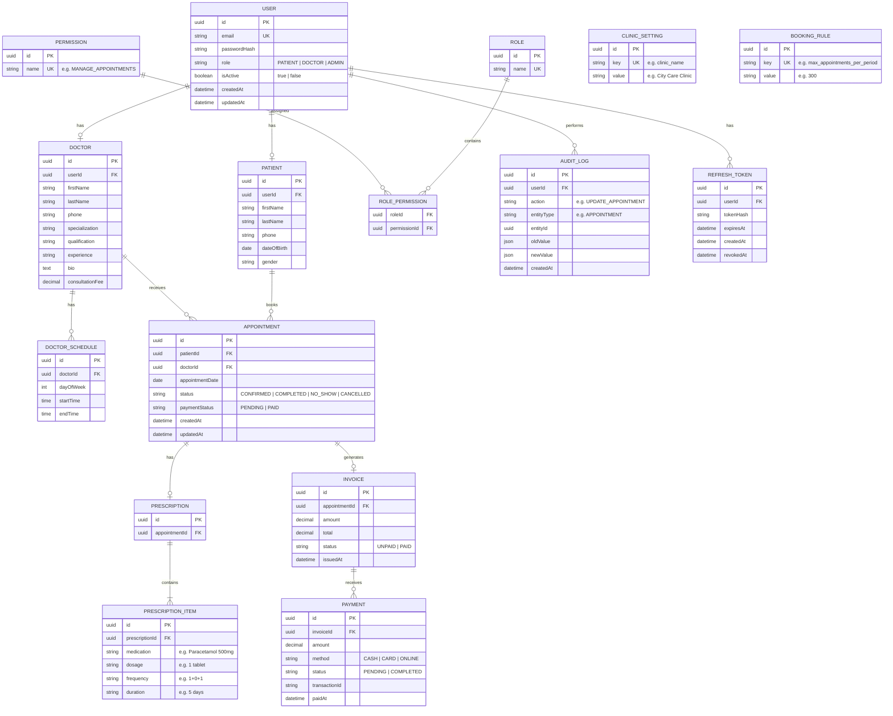

## ERD



# Features

## Patient

-  Register / Login 
-  Manage profile 
-  Search & filter doctors 
-  View doctor profiles 
-  View available time slots 
-  Book appointment 
-  View upcoming appointments 
-  View appointment history 
-  Make payments 
-  View invoices / payment history 
-  View prescriptions  

## Doctor

-  Login 
-  Manage profile 
-  Set consultation fees 
-  Set working hours 
-  View upcoming appointments 
-  View appointment history 
-  Cancel / reschedule appointments 
-  Mark appointment completed 
-  Mark patient as no-show 
-  View patient information 
-  Create prescription for appointment

## Admin

-  Everything needed to manage the clinic 
-  Manage doctors 
-  Manage patients 
-  Manage appointments 
-  Manage schedules 
-  Manage payments & refunds 
-  Manage invoices  
-  View reports & analytics 
-  Configure clinic settings 
-  Configure booking rules 
-  Manage roles & permissions 
-  View audit/history records


## Backend Foler Structure

```
clinic-appointment/
├── backend/
│   ├── prisma/
│   │   └── schema.prisma
│   │
│   ├── src/
│   │   ├── modules/
│   │   │   ├── auth/
│   │   │   │   ├── auth.routes.js
│   │   │   │   ├── auth.controller.js
│   │   │   │   ├── auth.service.js
│   │   │   │   └── auth.validation.js
│   │   │   │
│   │   │   ├── patient/
│   │   │   │   ├── patient.routes.js
│   │   │   │   ├── patient.controller.js
│   │   │   │   ├── patient.service.js
│   │   │   │   └── patient.validation.js
│   │   │   │
│   │   │   ├── doctor/
│   │   │   │   ├── doctor.routes.js
│   │   │   │   ├── doctor.controller.js
│   │   │   │   ├── doctor.service.js
│   │   │   │   └── doctor.validation.js
│   │   │   │
│   │   │   ├── appointment/
│   │   │   │   ├── appointment.routes.js
│   │   │   │   ├── appointment.controller.js
│   │   │   │   ├── appointment.service.js
│   │   │   │   └── appointment.validation.js
│   │   │   │
│   │   │   ├── prescription/
│   │   │   │   ├── prescription.routes.js
│   │   │   │   ├── prescription.controller.js
│   │   │   │   ├── prescription.service.js
│   │   │   │   └── prescription.validation.js
│   │   │   │
│   │   │   ├── invoice/
│   │   │   │   ├── invoice.routes.js
│   │   │   │   ├── invoice.controller.js
│   │   │   │   ├── invoice.service.js
│   │   │   │   └── invoice.validation.js
│   │   │   │
│   │   │   ├── payment/
│   │   │   │   ├── payment.routes.js
│   │   │   │   ├── payment.controller.js
│   │   │   │   ├── payment.service.js
│   │   │   │   └── payment.validation.js
│   │   │   │
│   │   │   └── admin/
│   │   │       ├── admin.routes.js
│   │   │       ├── admin.controller.js
│   │   │       ├── admin.service.js
│   │   │       └── admin.validation.js
│   │   │
│   │   ├── middlewares/
│   │   │   ├── auth.middleware.js
│   │   │   ├── error.middleware.js
│   │   │   └── validate.middleware.js
│   │   │
│   │   ├── config/
│   │   │   └── prisma.js
│   │   │
│   │   ├── utils/
│   │   │   ├── jwt.js
│   │   │   └── password.js
│   │   │
│   │   ├── app.js
│   │   └── server.js
│   │
│   ├── .env
│   ├── .env.example
│   ├── .gitignore
│   ├── package.json
│   └── prisma.config.ts
│
└── frontend/
```